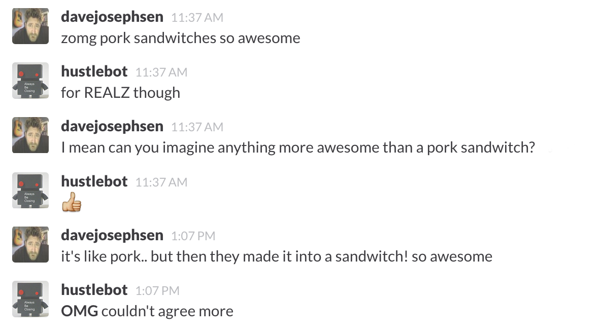

# Hubot: IKNOWRIGHT?!

hubot-ikr listens for adverb-phrases that commonly convey enthusiasm, and
responds by validating the shit out of them. 



Sometimes responding to every trigger word is too much for some users so you 
can turn hubot's agreeability down with the command:
be less agreeable
If you turn the agreeability down too far you can adjust it back up by saying:
be more agreeable
Agreeability setting is based on the TARS humor setting in the movie 
Interstellar so it responds to a percentage (integer).  So, if you want to 
set it to a specific percentage you can say:
set agreeability to 60% 
To query the current agreeability setting just ask:
agreeability?
or use any variant thereof with "agreeability?"" in the question, like:
What is your current agreeability?

## Installation

Run the following command to install this module as a Hubot dependency

```
$ npm install hubot-ikr --save
```

Add **hubot-ikr** to your hubot's `package.json` and `external-scripts.json` (you may need to create this file).

In package.json it looks like this: 
```
"dependencies": { 
"stuff",
"hubot-ikr": "0.0.1",
"other stuff"
}
```
In external-scripts.json it looks like this: 
```
  [
  "stuff",
  "hubot-ikr",
  "other stuff"
  ]
```
